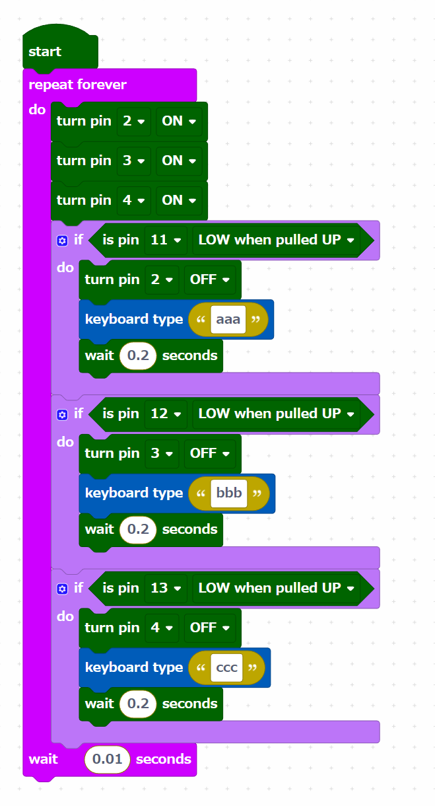

# はじめての自作キーボード

for 岐阜高専 公開講座（技術室）

Raspberry Pi Picoを使って自由にカスタマイズした定型文を入力できるキーボード

## 部品リスト

参考として購入先の例を示している。

公開講座でRaspberry Pi Picoを購入しなかった場合、[秋月電子](https://akizukidenshi.com/catalog/)で
`K-16149`を購入すると必要な部品が揃う。

<table>
	<tr>
		<td>部品</td>
		<td>数</td>
		<td>購入先</td>
	</tr>
	<tr>
		<td>基板</td>
		<td>1</td>
		<td>基板製造業者**</td>
	</tr>
	<tr>
		<td>Raspberry Pi Pico （ピンヘッダ付）</td>
		<td>1</td>
		<td rowspan="2">秋月電子 K-16149</td>
	</tr>
	<tr>
		<td>microUSBケーブル</td>
		<td>1</td>
	</tr>
	<tr>
		<td>LED</td>
		<td>3</td>
		<td>秋月電子 赤 I-11577 黄 I-11639 緑 I-11637</td>
	</tr>
	<tr>
		<td>ピンソケット （20ピン）</td>
		<td>2</td>
		<td>秋月電子 C-03077</td>
	</tr>
	<tr>
		<td>抵抗(1k)</td>
		<td>3</td>
		<td>秋月電子 R-25102</td>
	</tr>
	<tr>
		<td>キースイッチ</td>
		<td>3</td>
		<td>遊舎工房***</td>
	</tr>
	<tr>
		<td>キーキャップ</td>
		<td>3</td>
		<td>遊舎工房***</td>
	</tr>
	<tr>
		<td>CdSセル*</td>
		<td>1</td>
		<td>秋月電子 I-00110</td>
	</tr>
	<tr>
		<td>抵抗(10k)*</td>
		<td>1</td>
		<td>秋月電子 R-25103</td>
	</tr>
	<tr>
		<td>圧電スピーカー*</td>
		<td>1</td>
		<td>秋月電子 P-04118</td>
	</tr>
</table>

- \* 課題2, 3を行う場合のみ必要
- ** 中国の[Elecrow](https://www.elecrow.com/)などに[gerber.zip](./gerber.zip)を渡して発注する。2層基板
- *** 納期と品質と郵便が届かない可能性に目をつぶればAliExpressが安い

## セットアップ手順

Raspberry Pi PicoにCircuitPythonをインストールし、キーボードとして使用する。

Piper MakeというWebサービスを使う。Chromeで動作する。

[Piper Make](https://make.playpiper.com/)

上記サイトにアクセスし、左下の`SETUP MY PICO`をクリックし、指示に従う。

## サンプルプログラムの実行

Piper Makeの右下が`STORY MODE`になっているため、`CREATIVE MODE`に変更する。

`NEW PROJECT`を作成し、以下のようにブロックを配置する。

左下の`CONNECT`を押してから左上の`START`を押すと、プログラムが動作する。

注意: プログラムはRaspberry Pi Picoの電源を切ると消える。エクスプローラを開き、`CIRCUITPY`というドライブの中にある`code.py`に
同じプログラムを書き込むと、電源を切っても内容が保存され、次の起動時に自動的に実行される。

## 課題

基板でできることの紹介として、3つの課題を設定している。

公開講座では、課題1を必須で行い、時間が余った場合2や3に進む。

### 課題1 定型文をオリジナルのものに変更しよう

使用するプログラム: [code1.py](./code1.py)

ボタンを押すと定型文を入力できるプログラムがある。プログラムを変更し、自分の好きな言葉を入力できるようにしよう。

### 課題2 音の鳴るキーボードを作ろう

使用するプログラム: [code2.py](./code2.py)

ボタンを押すと音が鳴るプログラムがある。プログラムを変更し、ボタンによって鳴る音を変えてみよう。

### 課題3 テルミンもどきを作ろう

使用するプログラム: [code3.py](./code3.py)

ボタンを押すと音が鳴るプログラムがある。このプログラムは、センサを使って鳴る音を変えている。

センサは周囲のどのような値（温度？湿度？明るさ？加速度？傾き？）を読み取って音を変えているのか考えよう。

また、別のボタンを押すと音が1オクターブ上下するプログラムを作ろう。音の周波数を2倍にすると音は1オクターブ上がり、周波数を1/2倍にすると1オクターブ下がる。
